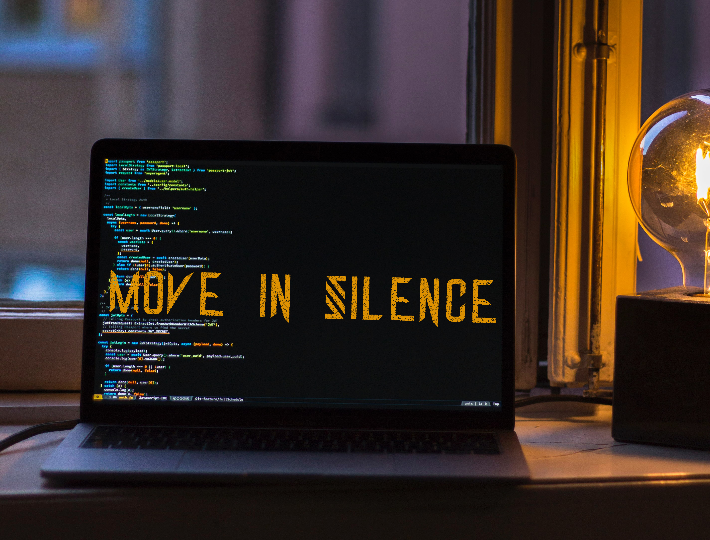

### Hi there I'm zohal, welcome to my profile 👋

 
    - 🌱 I’m currently learning Web development, UI design
    - 👯 I’m looking to collaborate on figma, zeplin, github, trello
    - 💬 Ask me about anything
    - 📫 How to reach me: zohalalfinas@gmail.com
    - ⚡ Fun fact: the earth is flat
 
 

**Cennect with me:**
 
 

 
 

**Languages and Tools:**

    

    

    

    

    

    

    

    

 
 

